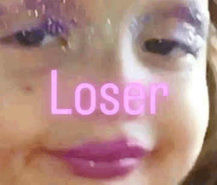

Hello! My name is Selin Atmaca.

This is my personal webpage.

I’ll put things I like here… if I don’t get lazy, so stay tuned.

```{=html}
<style>
*{box-sizing:border-box;margin:0;padding:0}
#gw{display:flex;flex-direction:column;align-items:center;gap:18px;padding:1.5rem 0;font-family:sans-serif}
#title-bar{font-size:26px;font-weight:500;color:#993356;letter-spacing:1px;text-align:center}
#title-sub{font-size:13px;color:#d4537e;text-align:center;margin-top:-10px}
#score-bar{display:flex;justify-content:space-between;width:640px;max-width:100%;font-size:15px;color:#993356;font-weight:500}
#score-bar span b{font-size:20px}
#canvas{border-bottom:3px solid #d4537e;background:#fff5f9;width:640px;max-width:100%;height:190px;display:block;border-radius:12px 12px 0 0;cursor:pointer}
#msg{font-size:16px;color:#993356;min-height:22px;text-align:center;font-weight:500}
#start-btn{padding:12px 36px;background:#d4537e;color:#fff;border:none;border-radius:10px;font-size:16px;cursor:pointer;font-weight:500;letter-spacing:.5px}
#start-btn:hover{background:#993356}
#lb-section{width:640px;max-width:100%}
#lb-title{font-size:20px;font-weight:500;color:#993356;margin-bottom:10px}
#lb-list{list-style:none;display:flex;flex-direction:column;gap:7px}
.lb-row{display:flex;align-items:center;gap:12px;background:#fff0f5;border:0.5px solid #f4c0d1;border-radius:10px;padding:8px 14px;font-size:14px}
.lb-rank{width:28px;font-size:16px;text-align:center}
.lb-name{flex:1;color:#333;font-weight:500}
.lb-score{font-weight:500;color:#d4537e;font-size:16px}
#name-form{display:flex;gap:8px;margin-bottom:12px}
#name-form input{flex:1;padding:10px 14px;border:1.5px solid #f4c0d1;border-radius:10px;font-size:14px;background:#fff5f9;color:#333;outline:none}
#name-form input:focus{border-color:#d4537e}
#name-form button{padding:10px 20px;background:#d4537e;color:#fff;border:none;border-radius:10px;font-size:14px;cursor:pointer;font-weight:500}
#name-form button:hover{background:#993356}
</style>

<div id="gw">
  <div id="title-bar">👑 Princess Runner 👑</div>
  <div id="title-sub">Jump over obstacles — how far can you go?</div>
  <div id="score-bar">
    <span>Score: <b id="score-disp">0</b></span>
    <span id="speed-disp" style="color:#f093b8">Speed: 1.0x</span>
    <span>Best: <b id="best-disp">0</b></span>
  </div>
  <canvas id="canvas" width="640" height="190"></canvas>
  <div id="msg">Press Space or tap to start</div>
  <button id="start-btn">▶ Start Game</button>
  <div id="lb-section">
    <div id="lb-title">🏆 Leaderboard</div>
    <div id="name-form">
      <input id="player-name" placeholder="Enter your name to save score" maxlength="20"/>
      <button onclick="saveScore()">Save</button>
    </div>
    <ul id="lb-list"></ul>
  </div>
</div>

<script>
const canvas=document.getElementById('canvas');
const ctx=canvas.getContext('2d');
const W=canvas.width,H=canvas.height,GROUND=H-24;
let dino,cacti,clouds,stars,score,best,speed,frame,running,raf,cactusTimer;

function initState(){
  dino={x:72,y:GROUND-54,w:28,h:54,vy:0,onGround:true,dead:false,lf:0};
  cacti=[];clouds=[];stars=[];
  for(let i=0;i<5;i++) clouds.push({x:Math.random()*W,y:18+Math.random()*40,r:13+Math.random()*10});
  for(let i=0;i<28;i++) stars.push({x:Math.random()*W,y:Math.random()*55,s:.8+Math.random()*1.2});
  score=0;speed=4;frame=0;running=false;cactusTimer=85;
}
initState();
best=parseInt(localStorage.getItem('princessBest2')||'0');
document.getElementById('best-disp').textContent=best;

function jump(){if(dino.onGround&&!dino.dead){dino.vy=-13.5;dino.onGround=false;}}
function startGame(){
  if(raf)cancelAnimationFrame(raf);
  initState();running=true;
  document.getElementById('msg').textContent='';
  document.getElementById('start-btn').style.display='none';
  loop();
}
function loop(){update();draw();if(!dino.dead)raf=requestAnimationFrame(loop);}

function update(){
  frame++;score++;
  speed=Math.min(4+score/280,20);
  document.getElementById('score-disp').textContent=score;
  document.getElementById('speed-disp').textContent='Speed: '+(speed/4).toFixed(1)+'x';
  dino.vy+=0.65;dino.y+=dino.vy;
  if(dino.y>=GROUND-dino.h){dino.y=GROUND-dino.h;dino.vy=0;dino.onGround=true;}
  if(dino.onGround)dino.lf++;
  cactusTimer--;
  if(cactusTimer<=0){
    cacti.push({x:W+20,w:12+Math.random()*9,h:26+Math.random()*24});
    cactusTimer=Math.max(28,88-Math.floor(score/180)*4);
  }
  cacti.forEach(c=>c.x-=speed);
  cacti=cacti.filter(c=>c.x>-50);
  clouds.forEach(c=>{c.x-=0.45;if(c.x<-70)c.x=W+70;});
  for(let c of cacti){
    if(dino.x+dino.w-9>c.x+3&&dino.x+9<c.x+c.w-3&&dino.y+dino.h-7>GROUND-c.h){
      endGame();return;
    }
  }
}

function drawPrincess(x,y,w,h,dead,lf){
  const cx=x+w/2;
  ctx.fillStyle='#f093b8';
  ctx.beginPath();ctx.moveTo(x,y+h);ctx.lineTo(x+w,y+h);ctx.lineTo(x+w-4,y+h*.52);ctx.lineTo(x+4,y+h*.52);ctx.closePath();ctx.fill();
  ctx.fillStyle='#f4c0d1';
  ctx.beginPath();ctx.moveTo(cx-4,y+h);ctx.lineTo(cx+4,y+h);ctx.lineTo(cx+2,y+h*.6);ctx.lineTo(cx-2,y+h*.6);ctx.closePath();ctx.fill();
  if(!dead){
    let lo=Math.sin(lf*.32)*3;
    ctx.fillStyle='#f9d4e0';ctx.fillRect(x+6,y+h-7,5,7+lo);ctx.fillRect(x+w-11,y+h-7,5,7-lo);
    ctx.fillStyle='#993356';ctx.fillRect(x+4,y+h+lo,8,4);ctx.fillRect(x+w-12,y+h-lo,8,4);
  }
  ctx.fillStyle='#e8609a';ctx.fillRect(x+4,y+h*.28,w-8,h*.26);
  ctx.fillStyle='#FAC775';ctx.fillRect(x+4,y+h*.5,w-8,3);
  ctx.fillStyle='#f9d4e0';
  if(!dead){
    let ao=Math.sin(lf*.32+1)*3;
    ctx.fillRect(x-4,y+h*.3+ao,5,13);ctx.fillRect(x+w-1,y+h*.3-ao,5,13);
  } else {
    ctx.fillRect(x-5,y+h*.36,6,11);ctx.fillRect(x+w-1,y+h*.28,6,11);
  }
  ctx.fillStyle='#f9d4e0';ctx.fillRect(cx-4,y+h*.22,8,h*.09);
  ctx.beginPath();ctx.ellipse(cx,y+h*.13,10.5,11.5,0,0,Math.PI*2);ctx.fill();
  ctx.fillStyle='#c2507a';
  ctx.beginPath();ctx.ellipse(cx,y+h*.07,10.5,7,0,0,Math.PI,true);ctx.fill();
  ctx.fillRect(x,y+h*.09,5,14);ctx.fillRect(x+w-5,y+h*.09,5,14);
  ctx.fillStyle='#FAC775';
  ctx.beginPath();ctx.moveTo(cx-9,y+h*.03);ctx.lineTo(cx-6,y-3);ctx.lineTo(cx-3,y+h*.03);ctx.lineTo(cx,y-7);ctx.lineTo(cx+3,y+h*.03);ctx.lineTo(cx+6,y-3);ctx.lineTo(cx+9,y+h*.03);ctx.closePath();ctx.fill();
  ctx.fillStyle='#f4c0d1';ctx.beginPath();ctx.arc(cx,y-5,2.2,0,Math.PI*2);ctx.fill();
  ctx.fillStyle='#f093b8';ctx.beginPath();ctx.arc(cx-6,y-1,1.5,0,Math.PI*2);ctx.fill();ctx.beginPath();ctx.arc(cx+6,y-1,1.5,0,Math.PI*2);ctx.fill();
  if(dead){
    ctx.strokeStyle='#993356';ctx.lineWidth=1.5;
    ctx.beginPath();ctx.moveTo(cx-5,y+h*.1);ctx.lineTo(cx-3,y+h*.14);ctx.moveTo(cx-3,y+h*.1);ctx.lineTo(cx-5,y+h*.14);ctx.stroke();
    ctx.beginPath();ctx.moveTo(cx+3,y+h*.1);ctx.lineTo(cx+5,y+h*.14);ctx.moveTo(cx+5,y+h*.1);ctx.lineTo(cx+3,y+h*.14);ctx.stroke();
  } else {
    ctx.fillStyle='#993356';ctx.beginPath();ctx.arc(cx-4,y+h*.12,2.2,0,Math.PI*2);ctx.fill();ctx.beginPath();ctx.arc(cx+4,y+h*.12,2.2,0,Math.PI*2);ctx.fill();
    ctx.fillStyle='#fff';ctx.beginPath();ctx.arc(cx-3,y+h*.11,.9,0,Math.PI*2);ctx.fill();ctx.beginPath();ctx.arc(cx+5,y+h*.11,.9,0,Math.PI*2);ctx.fill();
    ctx.strokeStyle='#993356';ctx.lineWidth=1;ctx.beginPath();ctx.arc(cx,y+h*.16,3,.1,Math.PI-.1);ctx.stroke();
  }
  if(!dead&&dino.onGround&&lf%14<3){
    ctx.fillStyle='#FAC775';
    ctx.beginPath();ctx.arc(x+w+5,y+h*.38,2.2,0,Math.PI*2);ctx.fill();
    ctx.beginPath();ctx.arc(x+w+11,y+h*.28,1.5,0,Math.PI*2);ctx.fill();
    ctx.beginPath();ctx.arc(x+w+3,y+h*.55,1.2,0,Math.PI*2);ctx.fill();
  }
}

function drawCactus(c){
  ctx.fillStyle='#d4537e';ctx.fillRect(c.x,GROUND-c.h,c.w,c.h);
  let aw=c.w*.65;
  ctx.fillRect(c.x-aw,GROUND-c.h*.68,aw,c.w*.55);ctx.fillRect(c.x+c.w,GROUND-c.h*.52,aw,c.w*.55);
  ctx.fillStyle='#f093b8';
  ctx.fillRect(c.x-aw,GROUND-c.h*.68-7,c.w*.5,8);ctx.fillRect(c.x+c.w+aw-c.w*.5,GROUND-c.h*.52-7,c.w*.5,8);
}

function draw(){
  ctx.clearRect(0,0,W,H);
  ctx.fillStyle='#fff5f9';ctx.fillRect(0,0,W,H);
  ctx.fillStyle='#f4c0d1';
  stars.forEach(s=>{ctx.beginPath();ctx.arc(s.x,s.y,s.s,0,Math.PI*2);ctx.fill();});
  ctx.fillStyle='#ffe0ee';
  clouds.forEach(c=>{
    ctx.beginPath();ctx.ellipse(c.x,c.y,c.r,c.r*.5,0,0,Math.PI*2);ctx.fill();
    ctx.beginPath();ctx.ellipse(c.x+c.r*.6,c.y-c.r*.3,c.r*.7,c.r*.4,0,0,Math.PI*2);ctx.fill();
  });
  ctx.fillStyle='#f4c0d1';
  for(let i=0;i<W;i+=18){
    let off=(frame*speed*.5)%18;ctx.beginPath();ctx.arc(i-off,GROUND+8,2,0,Math.PI*2);ctx.fill();
  }
  cacti.forEach(c=>drawCactus(c));
  drawPrincess(dino.x,dino.y,dino.w,dino.h,dino.dead,dino.lf);
}

function endGame(){
  dino.dead=true;running=false;draw();
  if(score>best){best=score;localStorage.setItem('princessBest2',best);document.getElementById('best-disp').textContent=best;document.getElementById('msg').textContent='New High Score! 🎉 '+score;}
  else document.getElementById('msg').textContent='Game Over! Score: '+score;
  document.getElementById('start-btn').style.display='inline-block';
  document.getElementById('start-btn').textContent='▶ Play Again';
}

document.getElementById('start-btn').addEventListener('click',startGame);
document.addEventListener('keydown',e=>{
  if(e.code==='Space'||e.code==='ArrowUp'){e.preventDefault();if(!running)startGame();else jump();}
});
canvas.addEventListener('click',()=>{if(!running)startGame();else jump();});
canvas.addEventListener('touchstart',e=>{e.preventDefault();if(!running)startGame();else jump();},{passive:false});
draw();

function loadLeaderboard(){
  try{
    const raw=localStorage.getItem('princessLB2');
    const entries=raw?JSON.parse(raw):[];
    entries.sort((a,b)=>b.score-a.score);
    const top=entries.slice(0,10);
    const ul=document.getElementById('lb-list');
    if(!top.length){ul.innerHTML='<li style="font-size:13px;color:#d4537e;padding:6px">No scores yet — be the first! 👑</li>';return;}
    const medals=['👑','✨','🌸'];
    ul.innerHTML=top.map((e,i)=>`<li class="lb-row"><span class="lb-rank">${medals[i]||i+1+'.'}</span><span class="lb-name">${e.name}</span><span class="lb-score">${e.score}</span></li>`).join('');
  }catch(err){
    document.getElementById('lb-list').innerHTML='<li style="font-size:13px;color:#d4537e">Could not load leaderboard</li>';
  }
}

function saveScore(){
  const name=document.getElementById('player-name').value.trim();
  if(!name){document.getElementById('msg').textContent='Please enter your name first!';return;}
  const s=score||best;
  if(!s){document.getElementById('msg').textContent='Play first to save a score!';return;}
  try{
    const raw=localStorage.getItem('princessLB2');
    let entries=raw?JSON.parse(raw):[];
    const idx=entries.findIndex(e=>e.name.toLowerCase()===name.toLowerCase());
    if(idx>=0){if(s>entries[idx].score)entries[idx].score=s;}
    else entries.push({name,score:s});
    localStorage.setItem('princessLB2',JSON.stringify(entries));
    loadLeaderboard();
    document.getElementById('msg').textContent='Saved! Good luck next time 👑';
  }catch(e){document.getElementById('msg').textContent='Could not save. Try again!';}
}
loadLeaderboard();
</script>
```

{width="400"}
